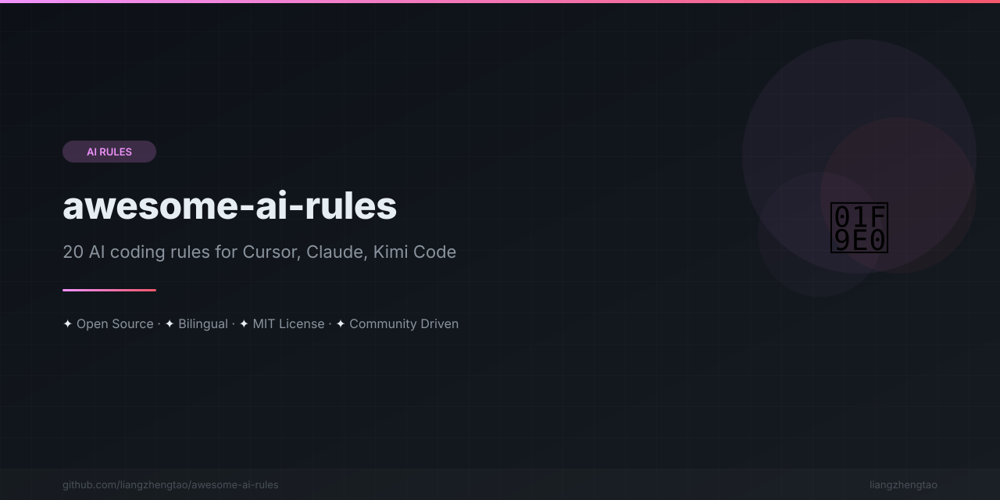

[English](README.md) | [中文](README.zh.md) | [日本語](README.ja.md) | [Français](README.fr.md) | [Español](README.es.md) | [العربية](README.ar.md) | [한국어](README.ko.md) | [Português](README.pt.md) | [Русский](README.ru.md) | [Deutsch](README.de.md)
n<div align="center">



</div>


# 🧠 Awesome AI Rules | 精选 AI 规则 | Awesome AI ルール | Règles IA Formidables | Reglas AI Increíbles | قواعد AI رائعة

<div align="center">

### Stop repeating yourself to AI. Write the rules once.

**20 production configuration templates for Cursor, Claude Code, Kimi Code, Copilot, and more.**

Copy-paste a rule file → your AI assistant instantly writes better code.

[](https://awesome.re)
[](CONTRIBUTING.md)
[](LICENSE)
[](rules/)

</div>

---

## Before / After

**Without rules** — AI generates generic, inconsistent code:
```tsx
const user = await fetch('/api/user');
const data = await user.json();
return <div>{data.name}</div>;
// No types. No error handling. No loading state. No tests.
```

**With `react.md` rules** — AI generates production code:
```tsx
const { data, isLoading, error } = useQuery({
  queryKey: ['user'],
  queryFn: () => api.getUser(),
});
if (isLoading) return <Skeleton />;
if (error) return <ErrorBoundary error={error} />;
return <UserProfile user={data} />;
// Typed. Tested. Accessible. Your conventions.
```

---

## Quick Start

```bash
# Pick your tool, copy the rule
cp rules/frameworks/react.md .cursorrules        # Cursor
cp rules/frameworks/react.md CLAUDE.md            # Claude Code
cp rules/frameworks/react.md AGENTS.md             # Kimi Code
```

**Stack multiple rules:**
```bash
cat rules/frameworks/react.md > .cursorrules
cat rules/frameworks/typescript.md >> .cursorrules
cat rules/scenarios/testing.md >> .cursorrules
```

---

## 20 Rules — 3 Categories

### 🛠️ Frameworks (7)

| Rule | Targets |
|------|---------|
| [React](rules/frameworks/react.md) | React 19+ / Server Components / React Compiler |
| [Next.js](rules/frameworks/nextjs.md) | Next.js 15+ / App Router / Async APIs |
| [Vue](rules/frameworks/vue.md) | Vue 3.4+ / Composition API / Pinia |
| [TypeScript](rules/frameworks/typescript.md) | TypeScript 5.x / strict mode |
| [Python FastAPI](rules/frameworks/python-fastapi.md) | Python 3.12+ / FastAPI 0.110+ / Pydantic V2 |
| [Rust](rules/frameworks/rust.md) | Rust 1.75+ / Axum 0.7+ / Tokio |
| [Go](rules/frameworks/go.md) | Go 1.22+ / Chi 5.x |

### 🎭 Scenarios (7)

| Rule | What It Covers |
|------|----------------|
| [Monorepo](rules/scenarios/monorepo.md) | Turborepo / pnpm workspaces / Changesets |
| [Microservices](rules/scenarios/microservices.md) | gRPC / Kafka / Kubernetes / Saga |
| [Mobile App](rules/scenarios/mobile-app.md) | React Native 0.74+ / Flutter 3.22+ |
| [Data Science](rules/scenarios/data-science.md) | pandas 2.x / scikit-learn / MLflow |
| [API Design](rules/scenarios/api-design.md) | REST / OpenAPI 3.1 / Pagination / Webhooks |
| [Testing](rules/scenarios/testing.md) | Vitest / Playwright / React Testing Library |
| [Performance](rules/scenarios/performance.md) | Core Web Vitals / Vite 5+ / Caching |

### 🔧 Tools (6)

| Rule | Tool |
|------|------|
| [Cursor](rules/tools/cursor.md) | Cursor 0.40+ |
| [Claude Code](rules/tools/claude-code.md) | Anthropic Claude Code |
| [Kimi Code](rules/tools/kimi-code.md) | Moonshot Kimi Code |
| [GitHub Copilot](rules/tools/copilot.md) | GitHub Copilot (multi-model) |
| [Windsurf](rules/tools/windsurf.md) | Codeium Windsurf |
| [Cline](rules/tools/cline.md) | Cline (VS Code) |

---

## How Rules Work

Each rule file follows a standard structure:

```
Core Principles    →  3–5 non-negotiable rules
Code Style         →  Naming, file structure, formatting
Proven Patterns     →  Framework-specific patterns with code examples
Common Pitfalls    →  ❌ Anti-patterns → ✅ Correct patterns
Dependencies       →  Recommended libraries
Project-Specific   →  Fill-in section for your project
```

All rules have **version annotations** so you know which framework version they target.

---

## Companions

| Tool | Purpose |
|------|---------|
| [**vibe-check**](https://github.com/liangzhengtao/vibe-check) | `npx vibe-check` — score your project's AI-readiness |

---

## FAQ

**Which tools support custom rules?**
Cursor (`.cursorrules`), Claude Code (`CLAUDE.md`), Kimi Code (`AGENTS.md`), GitHub Copilot (`.github/copilot-instructions.md`), Windsurf (`.windsurfrules`), Cline (`.clinerules`).

**How many rules should I use?**
1–3 framework rules + 1–2 scenario rules. Don't dump everything — keep it focused on your stack.

**Are these rules framework-version-specific?**
Yes. Each file has a `Last updated: 2026 | Targets: [version]` annotation.

**Can I contribute?**
Yes! See [CONTRIBUTING.md](CONTRIBUTING.md). We especially need rules for new frameworks and tools.

---

## See Also

| Project | Description |
|---------|-------------|
| [**vibe-check**](https://github.com/liangzhengtao/vibe-check) | `npx vibe-check` — Score your project's AI-readiness |
| [**ai-commit**](https://github.com/liangzhengtao/ai-commit) | `npx ai-commit` — AI writes your commit messages |
| [**awesome-mcp-servers**](https://github.com/liangzhengtao/awesome-mcp-servers) | MCP servers for Cursor, Claude Code, and Kimi Code |

## Contributing

See [CONTRIBUTING.md](CONTRIBUTING.md).

## License

[MIT](LICENSE)

---

<div align="center">

**Star this repo if it saved you time ⭐**

</div>

---
